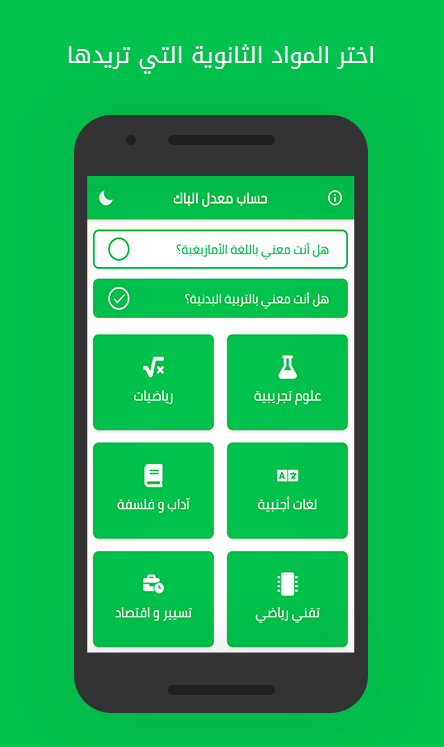
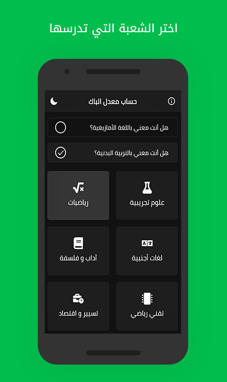
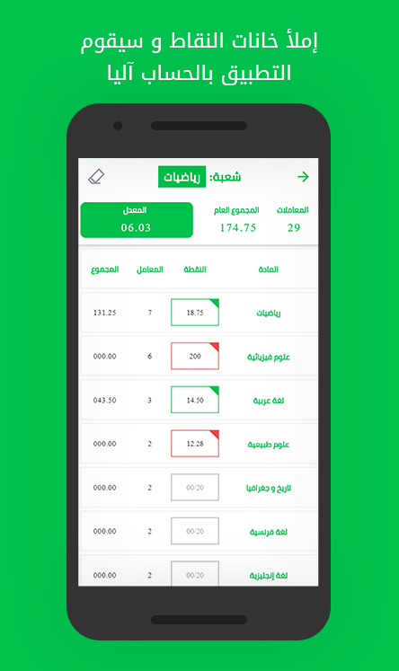

# BAC Average Calculator (حساب معدل الباك)

This is a project i did on my free time, and it is called **BAC Average Calculator (حساب معدل الباك)**.

Check out this project on [Play Store](https://play.google.com/store/apps/details?id=com.calculator.average.bac "حساب معدل الباك - Al-Yasa").

## Description

A baccalaureate average calculator app that is based on the Algerian curriculum.

This application allow you to calculate your BAC average by choosing a branch and any additional optional subjects then adding your exam marks for each subject, the app will display your average.

The project emphasizes using Ionic and Angular to build an Android application.

